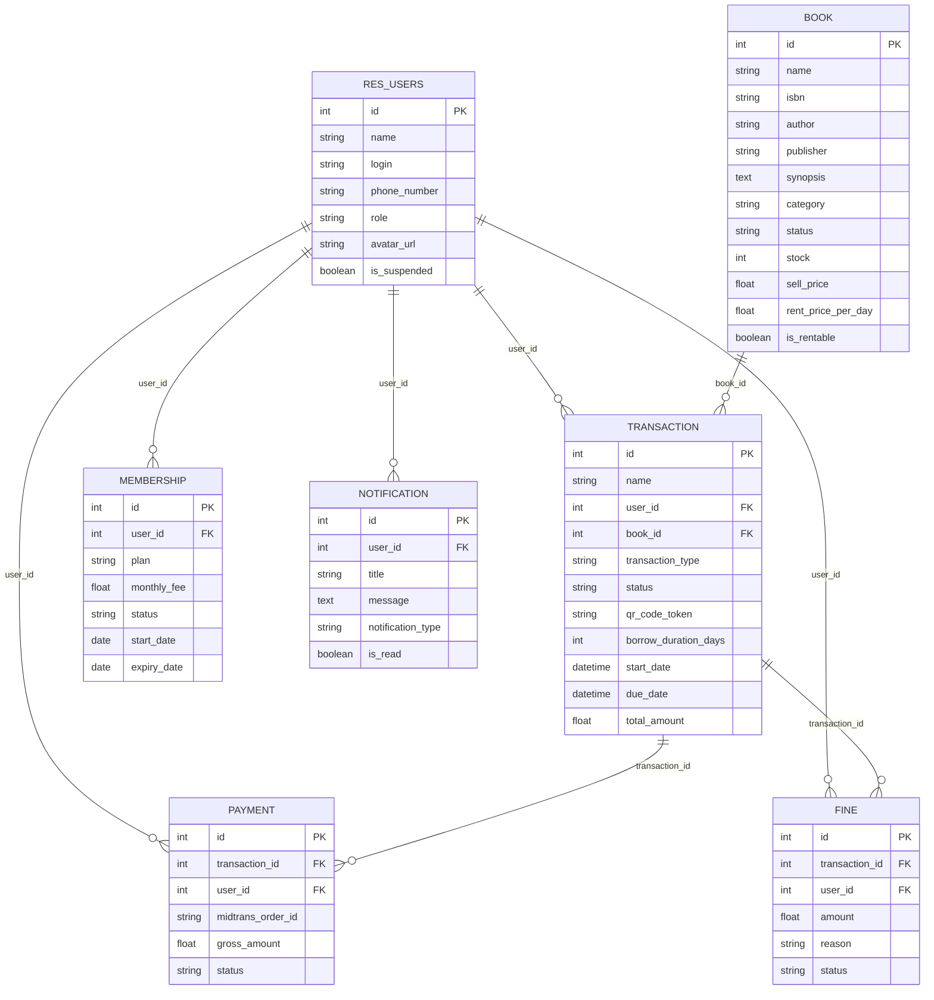

# 📚 BukuRumah — Modern Library Management System

> **Modul kustom Odoo 19** untuk manajemen peminjaman dan penjualan buku fisik dengan frontend portal modern, admin dashboard, QR Code pickup, dan REST API terintegrasi.

[](https://www.odoo.com)
[](https://python.org)
[](https://www.postgresql.org)
[](https://docker.com)
[](https://www.gnu.org/licenses/lgpl-3.0.html)

---

## 📖 Daftar Isi

- [Gambaran Umum](#-gambaran-umum)
- [Fitur Utama](#-fitur-utama)
- [Tech Stack](#-tech-stack)
- [Arsitektur Aplikasi](#-arsitektur-aplikasi)
- [Struktur Direktori](#-struktur-direktori)
- [Penjelasan Detail Per Folder](#-penjelasan-detail-per-folder)
  - [Root Files](#1-root-files-konfigurasi--infrastruktur)
  - [etc/ — Konfigurasi Odoo](#2-etc--konfigurasi-odoo-server)
  - [addons/rumah_buku/ — Modul Utama](#3-addonsrumah_buku--modul-utama)
  - [models/ — Data Layer (ORM)](#31-models--data-layer-orm)
  - [controllers/ — Business Logic & Routing](#32-controllers--business-logic--routing)
  - [services/ — Business Service Layer](#33-services--business-service-layer)
  - [views/ — QWeb Templates (UI)](#34-views--qweb-templates-ui)
  - [security/ — Access Control](#35-security--access-control-list)
  - [data/ — Seed Data](#36-data--seed-data)
  - [static/ — Frontend Assets](#37-static--frontend-assets)
- [Entity Relationship Diagram](#-entity-relationship-diagram)
- [API Reference](#-api-reference)
- [Alur Pengguna (User Flow)](#-alur-pengguna-user-flow)
- [Aturan Bisnis](#-aturan-bisnis)
- [Instalasi & Setup](#-instalasi--setup)
- [Navigasi & URL](#-navigasi--url)
- [Makefile Commands](#-makefile-commands)
- [Environment Variables](#-environment-variables)
- [Kredensial Default](#-kredensial-default)
- [Panduan Kontribusi](#-panduan-kontribusi)

---

## 🌟 Gambaran Umum

**BukuRumah** adalah sistem manajemen toko buku dan perpustakaan modern yang dibangun sebagai modul kustom Odoo 19. Proyek ini menggabungkan kemampuan ERP Odoo dengan antarmuka frontend yang modern dan responsif menggunakan **TailwindCSS CDN**, **QWeb templating**, dan **glassmorphism design**.

Aplikasi ini mencakup dua sisi utama:

| Sisi | Deskripsi |
|------|-----------|
| **Frontend Portal** | Katalog publik, detail buku, checkout, QR pickup, manajemen peminjaman pengguna |
| **Admin Portal** | Dashboard analitik, manajemen inventori, transaksi, laporan finansial, QR scanner, user management |

---

## ✨ Fitur Utama

### 🛒 Frontend (User Portal)

| Fitur | Deskripsi |
|-------|-----------|
| **Katalog Buku** | Pencarian real-time (judul, penulis, ISBN), filter kategori (8 kategori), sorting (newest/title/price), dan pagination (12 buku per halaman) |
| **Detail Buku** | Halaman detail lengkap: sinopsis, metadata (ISBN, publisher, tahun, halaman, stok, lokasi rak), harga sewa/beli, rekomendasi buku serupa |
| **Sistem Cart** | Drawer cart slide-in, tambah/hapus item, tampilkan subtotal, navigasi ke checkout |
| **Checkout** | Penjadwalan pickup (tanggal & slot waktu), pemilihan metode pembayaran mockup (QRIS, Bank Transfer, E-Wallet), ringkasan pesanan |
| **QR Code Pickup** | Generate QR Code pasca-checkout menggunakan token UUID untuk verifikasi pengambilan buku di perpustakaan |
| **My Rentals** | Tracking buku aktif (status: Active/Pickup/Overdue), histori peminjaman (Completed/Cancelled), request return |
| **Notifikasi** | Badge notifikasi unread pada header, notifikasi otomatis untuk pickup confirmation, denda, dan pengembalian |
| **Autentikasi** | Custom login page (standalone, tanpa header/footer), register page dengan validasi password confirmation |

### ⚙️ Admin Portal

| Fitur | Deskripsi |
|-------|-----------|
| **Dashboard** | Metrik: total buku, peminjaman aktif, total penjualan (Rp), outstanding fines; tabel transaksi terbaru; quick actions; system status |
| **Inventory Management** | Tabel buku dengan search/filter, metrik (total titles, currently borrowed, low stock alerts), pagination 10 per halaman |
| **User Management** | Daftar user portal, suspend/activate toggle, buat admin baru, metrik (total users, active, suspended) |
| **Transactions** | Semua transaksi non-pending, filter by status & type (borrow/buy), search by book/user/ID, pagination |
| **Financial Reports** | Total earnings, sales revenue, rental income, fines collected; grafik CSS-based bars; detail transaksi terbaru |
| **QR Scanner** | Verifikasi QR token (webcam/manual input), tampilkan detail transaksi, konfirmasi pickup dengan set start/due date |

### 🛡 Aturan Bisnis

| Aturan | Detail |
|--------|--------|
| **Durasi Peminjaman Default** | 10 hari |
| **Denda Keterlambatan** | Rp 5.000 per hari setelah due date |
| **Platform Fee** | Rp 2.000 per checkout |
| **Harga Sewa Default** | Rp 5.000/hari (dapat dikustomisasi per buku) |
| **Membership Plan** | Basic (Rp 50.000/bulan), Premium |
| **Role System** | `user`, `admin`, `superadmin` — diatur melalui Odoo groups + custom field |

---

## 🛠 Tech Stack

| Layer | Teknologi |
|-------|-----------|
| **Framework** | Odoo 19 (Python 3.x) |
| **ORM** | Odoo ORM (Models, Fields, Computed Fields, Relations) |
| **Templating** | QWeb (XML-based, server-side rendering) |
| **Database** | PostgreSQL 16 |
| **Frontend Styling** | TailwindCSS CDN (v3, dengan plugins: forms, container-queries) + Custom CSS |
| **Typography** | Google Fonts — Inter (body), Playfair Display (headlines) |
| **Iconography** | Google Material Symbols (Outlined, variable weight/fill) |
| **Design System** | Custom color tokens (Material Design 3 inspired), Glassmorphism effects |
| **QR Code** | Python `qrcode` library (server-side generation) + fallback ke `api.qrserver.com` |
| **Infrastructure** | Docker & Docker Compose |
| **Web Server** | Werkzeug (built-in Odoo) |
| **Payment** | Midtrans webhook skeleton (mock implementation) |
| **License** | LGPL-3 |

---

## 🏗 Arsitektur Aplikasi

```
┌──────────────────────────────────────────────────────────────────────┐
│                        BROWSER (Client)                              │
│  ┌─────────────────────┐     ┌──────────────────────────────────┐   │
│  │  Frontend Portal     │     │  Admin Portal                    │   │
│  │  (QWeb + Tailwind)   │     │  (QWeb + Tailwind)               │   │
│  └─────────┬───────────┘     └─────────────┬────────────────────┘   │
└────────────┼───────────────────────────────┼────────────────────────┘
             │ HTTP/HTML                      │ HTTP/HTML
             ▼                               ▼
┌──────────────────────────────────────────────────────────────────────┐
│                    ODOO 19 SERVER (Docker)                            │
│                                                                      │
│  ┌────────────────────────────────────────────────────────────────┐  │
│  │                    Controllers Layer                            │  │
│  │  ┌──────────────┐ ┌──────────────┐ ┌──────────────────────┐   │  │
│  │  │ frontend_    │ │ admin_       │ │ auth_controller      │   │  │
│  │  │ controller   │ │ controller   │ │ (Login/Register)     │   │  │
│  │  └──────────────┘ └──────────────┘ └──────────────────────┘   │  │
│  │  ┌──────────────┐ ┌──────────────┐ ┌──────────────────────┐   │  │
│  │  │ book_        │ │ qr_          │ │ transaction_         │   │  │
│  │  │ controller   │ │ controller   │ │ controller           │   │  │
│  │  │ (REST API)   │ │ (QR API)     │ │ (API)                │   │  │
│  │  └──────────────┘ └──────────────┘ └──────────────────────┘   │  │
│  │  ┌──────────────┐                                             │  │
│  │  │ payment_     │                                             │  │
│  │  │ controller   │                                             │  │
│  │  │ (Webhook)    │                                             │  │
│  │  └──────────────┘                                             │  │
│  └────────────────────────────────────────────────────────────────┘  │
│                              │                                       │
│  ┌───────────────────────────▼────────────────────────────────────┐  │
│  │                    Services Layer                               │  │
│  │  ┌──────────────────────────────────────────────────────────┐  │  │
│  │  │ transaction_service (AbstractModel)                       │  │  │
│  │  │ • create_borrow_transaction()                             │  │  │
│  │  │ • confirm_pickup() — QR verification → set dates          │  │  │
│  │  │ • complete_return() — auto fine calculation                │  │  │
│  │  └──────────────────────────────────────────────────────────┘  │  │
│  └────────────────────────────────────────────────────────────────┘  │
│                              │                                       │
│  ┌───────────────────────────▼────────────────────────────────────┐  │
│  │                    Models Layer (ORM)                           │  │
│  │  Book │ Transaction │ Fine │ Payment │ Membership │ User │ Notif│  │
│  └────────────────────────────────────────────────────────────────┘  │
│                              │                                       │
└──────────────────────────────┼───────────────────────────────────────┘
                               │ SQL
                               ▼
                    ┌──────────────────────┐
                    │  PostgreSQL 16        │
                    │  (Docker Container)   │
                    └──────────────────────┘
```

---

## 📁 Struktur Direktori

```
rumah_buku_v2/
├── .env                          # Environment variables (DB credentials, Odoo config)
├── .gitignore                    # Git ignore rules
├── docker-compose.yml            # Docker Compose: Odoo 19 + PostgreSQL 16
├── Makefile                      # Shortcut commands (start, stop, console, psql, logs)
├── README.md                     # ← Anda membaca file ini
│
├── etc/
│   └── odoo/
│       └── odoo.conf             # Konfigurasi server Odoo (DB host, password, addons path)
│
├── addons/
│   └── rumah_buku/               # ★ MODUL UTAMA ODOO
│       ├── __init__.py           # Import: models, controllers, services
│       ├── __manifest__.py       # Manifest modul (nama, versi, dependensi, data files, assets)
│       │
│       ├── models/               # Data Layer — Odoo ORM Models
│       │   ├── __init__.py
│       │   ├── book.py           # Model buku (15 fields + computed cover URL)
│       │   ├── transaction.py    # Model transaksi (borrow/buy, QR token, overdue detection)
│       │   ├── fine.py           # Model denda (late_return, damaged, lost)
│       │   ├── payment.py        # Model pembayaran (Midtrans integration skeleton)
│       │   ├── membership.py     # Model keanggotaan (basic/premium, auto-renew)
│       │   ├── notification.py   # Model notifikasi (order_update, fine_alert, system)
│       │   └── user.py           # Extend res.users (role, phone, avatar, is_suspended)
│       │
│       ├── controllers/          # HTTP Controllers — Routing & Business Logic
│       │   ├── __init__.py
│       │   ├── frontend_controller.py   # Frontend routes: catalog, detail, cart, checkout, rentals
│       │   ├── admin_controller.py      # Admin routes: dashboard, inventory, users, transactions, financial, scan
│       │   ├── auth_controller.py       # Auth routes: custom login & signup (override Home)
│       │   ├── book_controller.py       # REST API: GET/POST /api/books
│       │   ├── qr_controller.py         # REST API: QR generate, verify, confirm-pickup
│       │   ├── transaction_controller.py # REST API: POST /api/transactions
│       │   └── payment_controller.py    # Webhook: POST /api/payments/webhook (Midtrans)
│       │
│       ├── services/             # Business Service Layer (Abstract Models)
│       │   ├── __init__.py
│       │   └── transaction_service.py   # Logika bisnis: borrow, pickup confirm, return + auto fine
│       │
│       ├── views/                # QWeb XML Templates (UI)
│       │   ├── frontend_templates.xml   # Layout utama + Header + Footer + Cart Drawer + Catalog Page
│       │   ├── frontend_portal.xml      # Book Detail + Checkout + My Rentals
│       │   ├── frontend_auth.xml        # Login Page + Register Page (standalone)
│       │   └── admin_portal.xml         # Admin Layout + Dashboard + Inventory + Users + Transactions + Financial + QR Scanner
│       │
│       ├── security/
│       │   └── ir.model.access.csv      # Access Control List (ACL) — 19 rules untuk 7 model × 3 groups
│       │
│       ├── data/
│       │   └── seed_books.xml           # Seed data: 15 buku sample (Indonesia + International)
│       │
│       └── static/
│           └── src/
│               ├── css/
│               │   └── style.css        # Custom CSS: glassmorphism, scrollbar, animations, print styles
│               └── img/
│                   └── no_cover.png     # Fallback image jika buku tidak memiliki cover
│
└── var/
    └── lib/
        └── odoo/                 # Odoo filestore volume (auto-generated, gitignored)
```

---

## 📂 Penjelasan Detail Per Folder

### 1. Root Files (Konfigurasi & Infrastruktur)

#### `docker-compose.yml`

Mendefinisikan dua service Docker yang berjalan di jaringan `odoo-network` (bridge driver):

| Service | Image | Port | Volume Mapping |
|---------|-------|------|----------------|
| `rumah_buku_odoo` | `odoo:19.0` | `8069:8069` | `./etc/odoo:/etc/odoo`, `./addons:/mnt/extra-addons`, `./var/lib/odoo:/var/lib/odoo` |
| `odoo-postgres` | `postgres:16` | `5432:5432` | Host path → `/var/lib/postgresql/data/pgdata` |

> **Catatan**: Port 5432 di-expose agar database dapat diakses via tools eksternal (DBeaver, pgAdmin, dsb).

#### `Makefile`

Menyediakan shortcut commands untuk operasi Docker yang sering digunakan:

| Command | Deskripsi |
|---------|-----------|
| `make start` | Menjalankan Docker Compose di background (`-d`) |
| `make stop` | Menghentikan semua container |
| `make restart` | Restart semua container |
| `make console` | Masuk ke shell bash container Odoo |
| `make psql` | Masuk ke PostgreSQL interactive shell (database `odoo_development`) |
| `make logs odoo` | Streaming logs container Odoo |
| `make logs db` | Streaming logs container PostgreSQL |

#### `.env`

Menyimpan environment variables untuk kedua container:

```
# Odoo → koneksi ke PostgreSQL
HOST=odoo-postgres
USER=odoo
PASSWORD=odoo

# PostgreSQL → inisialisasi database
POSTGRES_DB=postgres
POSTGRES_USER=odoo
POSTGRES_PASSWORD=odoo
PGDATA=/var/lib/postgresql/data/pgdata
```

> ⚠️ File `.env` di-gitignore secara default. Setiap developer perlu membuat file ini secara manual berdasarkan template di atas.

#### `.gitignore`

Mengabaikan: `__pycache__/`, `*.py[cod]`, `.env`, `var/` (filestore), `*.log`, dan file editor (`.vscode/`, `.idea/`, `.DS_Store`, `Thumbs.db`).

---

### 2. `etc/` — Konfigurasi Odoo Server

#### `etc/odoo/odoo.conf`

```ini
[options]
admin_passwd = <hashed_pbkdf2>
db_host = odoo-postgres
db_user = odoo
db_password = odoo
db_port = 5432
addons_path = /usr/lib/python3/dist-packages/odoo/addons,/mnt/extra-addons
```

| Parameter | Penjelasan |
|-----------|------------|
| `admin_passwd` | Master password (hashed PBKDF2-SHA512) untuk operasi database management via Odoo UI |
| `db_host` | Hostname service PostgreSQL dalam Docker network |
| `addons_path` | Path pencarian modul: Odoo built-in + custom addons (`/mnt/extra-addons` → `./addons/`) |

---

### 3. `addons/rumah_buku/` — Modul Utama

#### `__manifest__.py`

Manifest file yang mendefinisikan metadata modul Odoo:

```python
{
    'name': 'Rumah Buku',
    'version': '2.0',
    'summary': 'Manajemen Toko Buku & Peminjaman (Gelari Medika)',
    'author': 'Antigravity',
    'category': 'Sales/Rumah Buku',
    'depends': ['base', 'web', 'mail'],     # Dependensi modul Odoo
    'license': 'LGPL-3',
    'installable': True,
    'application': True,                     # Muncul di menu "Apps"
}
```

**Dependensi:**
- `base` — Core Odoo (users, groups, sequences, dsb)
- `web` — Web framework, assets management, controllers
- `mail` — Messaging system (required oleh beberapa base models)

**Data files yang dimuat saat install/upgrade** (urutan penting):
1. `security/ir.model.access.csv` — ACL rules
2. `views/frontend_templates.xml` — Layout + Catalog
3. `views/frontend_auth.xml` — Login/Register
4. `views/frontend_portal.xml` — Book Detail, Checkout, My Rentals
5. `views/admin_portal.xml` — Seluruh Admin UI
6. `data/seed_books.xml` — 15 buku sample

**Frontend assets** yang di-bundle ke `web.assets_frontend`:
- `rumah_buku/static/src/css/style.css`

#### `__init__.py`

```python
from . import models
from . import controllers
from . import services
```

Meng-import ketiga sub-package agar Odoo dapat melakukan auto-discovery terhadap model, controller, dan service.

---

### 3.1. `models/` — Data Layer (ORM)

Berisi definisi model database menggunakan Odoo ORM. Setiap file merepresentasikan satu entity dalam sistem.

---

#### 📘 `book.py` — Model Buku

**ORM Name**: `rumah_buku.book`

| Field | Tipe | Keterangan |
|-------|------|------------|
| `name` | `Char` | Judul buku (**required**) |
| `isbn` | `Char` | International Standard Book Number |
| `author` | `Char` | Nama penulis (**required**) |
| `publisher` | `Char` | Penerbit |
| `synopsis` | `Text` | Sinopsis/deskripsi buku |
| `cover_url` | `Char` | URL gambar cover eksternal |
| `cover_image` | `Binary` | Upload cover sebagai binary (attachment) |
| `category` | `Selection` | `fiction`, `non_fiction`, `tech_business`, `science`, `history`, `art_design`, `self_help`, `other` |
| `status` | `Selection` | `available`, `borrowed`, `sold` |
| `stock` | `Integer` | Jumlah stok tersedia (default: 1) |
| `location_rack` | `Char` | Lokasi rak buku (e.g., `A-01`) |
| `sell_price` | `Float` | Harga jual dalam Rupiah |
| `rent_price_per_day` | `Float` | Harga sewa per hari (default: Rp 5.000) |
| `is_rentable` | `Boolean` | Apakah buku dapat disewa (default: `True`) |
| `publication_year` | `Char` | Tahun terbit |
| `pages` | `Integer` | Jumlah halaman |
| `cover_display_url` | `Char` | **Computed** — Prioritas: `cover_image` → `cover_url` → fallback `no_cover.png` |

**Methods:**
- `_compute_cover_display_url()` — Menghitung URL cover display berdasarkan prioritas: binary image → external URL → fallback
- `get_category_label(key)` — Mengembalikan label human-readable dari selection key

---

#### 📗 `transaction.py` — Model Transaksi

**ORM Name**: `rumah_buku.transaction`

| Field | Tipe | Keterangan |
|-------|------|------------|
| `name` | `Char` | Nomor transaksi auto-generated via `ir.sequence` |
| `user_id` | `Many2one → res.users` | User yang melakukan transaksi |
| `book_id` | `Many2one → rumah_buku.book` | Buku yang ditransaksikan |
| `transaction_type` | `Selection` | `borrow` (sewa) atau `buy` (beli) |
| `status` | `Selection` | `pending` → `ready_for_pickup` → `borrowed` → `completed` / `cancelled` |
| `qr_code_token` | `Char` | UUID token unik untuk QR Code verification |
| `borrow_duration_days` | `Integer` | Durasi sewa (default: 10 hari) |
| `start_date` | `Datetime` | Tanggal mulai (diset saat admin confirm pickup) |
| `due_date` | `Datetime` | Tanggal jatuh tempo (start + duration) |
| `returned_date` | `Datetime` | Tanggal pengembalian aktual |
| `pickup_date` | `Date` | Tanggal pengambilan yang dijadwalkan user |
| `pickup_time` | `Char` | Slot waktu pengambilan (e.g., `09:00 AM - 11:00 AM`) |
| `total_amount` | `Float` | **Computed & Stored** — Buy: `sell_price`, Borrow: `rent_price_per_day × duration` |
| `is_overdue` | `Boolean` | **Computed** — `True` jika status `borrowed` dan `now > due_date` |
| `payment_ids` | `One2many → rumah_buku.payment` | Pembayaran terkait |
| `fine_ids` | `One2many → rumah_buku.fine` | Denda terkait |

**Transaction Status Flow:**
```
pending → ready_for_pickup → borrowed → completed
                                     → cancelled
```

**Methods:**
- `create(vals)` — Override: auto-generate nomor transaksi via `ir.sequence`
- `_compute_total_amount()` — Hitung total berdasarkan tipe transaksi
- `_compute_is_overdue()` — Deteksi keterlambatan secara real-time

---

#### 📕 `fine.py` — Model Denda

**ORM Name**: `rumah_buku.fine`

| Field | Tipe | Keterangan |
|-------|------|------------|
| `transaction_id` | `Many2one → rumah_buku.transaction` | Transaksi terkait |
| `user_id` | `Many2one → res.users` | User yang didenda |
| `amount` | `Float` | Jumlah denda (Rp) |
| `reason` | `Selection` | `late_return`, `damaged`, `lost` |
| `status` | `Selection` | `unpaid`, `paid` |

---

#### 📙 `payment.py` — Model Pembayaran

**ORM Name**: `rumah_buku.payment`

| Field | Tipe | Keterangan |
|-------|------|------------|
| `transaction_id` | `Many2one → rumah_buku.transaction` | Transaksi terkait |
| `user_id` | `Many2one → res.users` | User yang membayar |
| `midtrans_order_id` | `Char` | Order ID dari Midtrans |
| `gross_amount` | `Float` | Total pembayaran |
| `payment_type` | `Char` | Jenis pembayaran (qris, bank_transfer, dsb) |
| `status` | `Selection` | `pending`, `settlement`, `expire`, `cancel` |
| `paid_at` | `Datetime` | Timestamp pembayaran berhasil |

---

#### 📒 `membership.py` — Model Keanggotaan

**ORM Name**: `rumah_buku.membership`

| Field | Tipe | Keterangan |
|-------|------|------------|
| `user_id` | `Many2one → res.users` | Member |
| `plan` | `Selection` | `basic` (Rp 50.000/bulan), `premium` |
| `monthly_fee` | `Float` | Biaya per bulan |
| `status` | `Selection` | `active`, `expired`, `cancelled` |
| `start_date` | `Date` | Tanggal mulai (default: today) |
| `expiry_date` | `Date` | Tanggal kadaluarsa |
| `auto_renew` | `Boolean` | Auto-perpanjang (default: `True`) |

---

#### 📓 `notification.py` — Model Notifikasi

**ORM Name**: `rumah_buku.notification`

| Field | Tipe | Keterangan |
|-------|------|------------|
| `user_id` | `Many2one → res.users` | Penerima notifikasi |
| `title` | `Char` | Judul notifikasi |
| `message` | `Text` | Isi pesan |
| `notification_type` | `Selection` | `order_update`, `fine_alert`, `system` |
| `is_read` | `Boolean` | Status sudah dibaca (default: `False`) |

---

#### 📔 `user.py` — Ekstensi Model User

**ORM Name**: `res.users` (inherits)

Meng-extend model bawaan Odoo `res.users` dengan field tambahan:

| Field | Tipe | Keterangan |
|-------|------|------------|
| `phone_number` | `Char` | Nomor telepon |
| `role` | `Selection` | `user`, `admin`, `superadmin` |
| `avatar_url` | `Char` | URL avatar pengguna |
| `is_suspended` | `Boolean` | Status suspend (default: `False`) |

---

### 3.2. `controllers/` — Business Logic & Routing

Berisi HTTP controllers yang menangani routing URL, business logic, dan rendering template.

---

#### 🌐 `frontend_controller.py` — Frontend Portal Routes

**Class**: `FrontendController(http.Controller)`

| Route | Method | Auth | Deskripsi |
|-------|--------|------|-----------|
| `/ , /catalog` | GET | `public` | Katalog buku dengan search, filter kategori, sort (newest/title/price), pagination (12/page) |
| `/book/<int:book_id>` | GET | `public` | Detail buku + rekomendasi buku serupa (same category, max 5) |
| `/cart/add` | POST | `user` | Tambah buku ke cart (buat transaksi pending). Validasi: status=available, stock>0 |
| `/cart/remove` | POST | `user` | Hapus item dari cart (delete transaksi pending). Validasi: ownership + status pending |
| `/cart/checkout` | GET | `user` | Halaman checkout: daftar item, subtotal, platform fee (Rp 2.000), grand total |
| `/cart/confirm` | POST | `user` | Konfirmasi checkout: set status `ready_for_pickup`, generate UUID token, simpan pickup date/time/payment method |
| `/my-rentals` | GET | `user` | Halaman peminjaman user: active rentals (ready_for_pickup, borrowed) + history (completed, cancelled) |
| `/my-rentals/return` | POST | `user` | Request pengembalian buku: panggil `transaction_service.complete_return()` |

**Fitur Pencarian Katalog:**
- **Search fields**: `name`, `author`, `isbn` (case-insensitive, OR logic)
- **Category filter**: 8 kategori (Fiction, Non-Fiction, Tech & Business, Science, History, Art & Design, Self Help, + All)
- **Status filter**: `rent` (is_rentable=True), `sale` (sell_price>0)
- **Sorting**: `newest` (create_date desc), `title` (name asc), `price_low`, `price_high`
- **Pagination**: `BOOKS_PER_PAGE = 12`

---

#### 🔧 `admin_controller.py` — Admin Portal Routes

**Class**: `AdminController(http.Controller)`

Semua route di-protect oleh method `_check_admin()` yang memvalidasi user memiliki group `base.group_system`. Jika tidak, raise `werkzeug.exceptions.Forbidden`.

| Route | Method | Deskripsi |
|-------|--------|-----------|
| `/admin/dashboard` | GET | Dashboard: metrik (total_books, active_rentals, total_sales, outstanding_fines, total_users), recent transactions (limit 5), quick actions |
| `/admin/inventory` | GET | Inventory: search/filter buku, tabel dengan cover+detail, metrik (total titles, borrowed count, low stock ≤2), pagination 10/page |
| `/admin/users` | GET | User list: search by name/login, filter by status (active/suspended), metrik, pagination 10/page |
| `/admin/users/suspend` | POST | Toggle `is_suspended` pada user tertentu |
| `/admin/users/create-admin` | GET/POST | Form buat admin baru: create `res.users` dengan groups `base.group_user` + `base.group_system` |
| `/admin/transactions` | GET | Daftar transaksi: search by name/book/user, filter by status & type, pagination 10/page |
| `/admin/transactions/update-status` | POST | Update status transaksi (admin manual override) |
| `/admin/financial` | GET | Laporan finansial: total earnings, sales revenue, rental income, fines collected, recent transactions |
| `/admin/scan` | GET | Halaman QR Scanner (render template saja, logic verifikasi via API) |

---

#### 🔐 `auth_controller.py` — Authentication Routes

**Class**: `AuthController(Home)` — Extends Odoo's built-in `Home` controller

| Route | Method | Auth | Deskripsi |
|-------|--------|------|-----------|
| `/web/login` | GET/POST | `none` | Custom login page: override default Odoo login, render `rumah_buku.frontend_login` template. POST: authenticate via `request.session.authenticate()` |
| `/web/signup` | GET/POST | `public` | Custom register page: validasi password match, create user dengan group `base.group_portal`, auto-login setelah registrasi, redirect ke `/catalog` |

> **Catatan**: Login dan register menggunakan standalone template (tanpa header/footer) dengan desain split-screen (gambar kiri + form kanan).

---

#### 📡 `book_controller.py` — REST API Buku

**Class**: `BookController(http.Controller)`

| Endpoint | Method | Auth | Request | Response |
|----------|--------|------|---------|----------|
| `GET /api/books` | GET | `public` | Query params: `search`, `category`, `status`, `page`, `limit` | `{ status, data: [...], pagination: { page, limit, total, total_pages } }` |
| `GET /api/books/<id>` | GET | `public` | Path param: `book_id` | `{ status, data: { id, name, author, isbn, publisher, synopsis, category, status, stock, sell_price, rent_price_per_day, is_rentable, cover_url, publication_year, pages, location_rack } }` |
| `POST /api/books` | POST | `user` (admin only) | JSON body: `{ name, author, isbn, publisher, synopsis, category, sell_price, rent_price_per_day, stock, location_rack, publication_year, pages, cover_url }` | `{ status, id, message }` |

> **Authorization**: `POST /api/books` memerlukan `base.group_system`. Jika tidak authorized, return HTTP 403.

---

#### 📱 `qr_controller.py` — QR Code API

**Class**: `QRController(http.Controller)`

| Endpoint | Method | Auth | Deskripsi |
|----------|--------|------|-----------|
| `GET /api/qr/generate/<transaction_id>` | GET | `user` | Generate QR Code PNG image. Jika library `qrcode` tersedia, generate server-side (fill color: `#1a3a3a`). Fallback: redirect ke `api.qrserver.com` |
| `POST /api/qr/verify` | POST | `user` | Verifikasi QR token. Body: `{ "token": "uuid" }`. Return: detail transaksi (book title, author, user, type, status, amount, duration, cover) |
| `POST /api/qr/confirm-pickup` | POST | `user` | Konfirmasi pickup: panggil `transaction_service.confirm_pickup(token)`. Set status `borrowed`, `start_date`, `due_date`. Update book stock. Create notification |

---

#### 💳 `transaction_controller.py` — Transaction API

**Class**: `TransactionController(http.Controller)`

| Endpoint | Method | Auth | Deskripsi |
|----------|--------|------|-----------|
| `POST /api/transactions` | POST | `user` | Buat transaksi borrow via API. Body: `{ "book_id": int, "duration": int }`. Return: `{ status, transaction_id, qr_token }` |

---

#### 💰 `payment_controller.py` — Payment Webhook

**Class**: `PaymentController(http.Controller)`

| Endpoint | Method | Auth | Deskripsi |
|----------|--------|------|-----------|
| `POST /api/payments/webhook` | POST | `public` | Midtrans webhook handler (skeleton). Menerima notifikasi status pembayaran. Status mapping: `settlement/capture` → `settlement`, `cancel/deny/expire` → `cancel` |

> **Catatan**: Ini adalah **mock implementation**. Tidak ada integrasi aktif ke Midtrans, tetapi endpoint dan logic handler sudah tersedia untuk development lanjutan.

---

### 3.3. `services/` — Business Service Layer

#### `transaction_service.py`

**Class**: `TransactionService(models.AbstractModel)` — `_name = 'rumah_buku.transaction_service'`

Menggunakan **Abstract Model** (tidak membuat tabel database), berfungsi sebagai service layer yang mengelola logika bisnis transaksi.

| Method | Deskripsi |
|--------|-----------|
| `create_borrow_transaction(user_id, book_id, duration_days=10, notes=None)` | Buat transaksi borrow baru. Validasi: buku available + stok > 0. Generate UUID token. Status awal: `pending` |
| `confirm_pickup(qr_token)` | Admin scan QR → set `status='borrowed'`, `start_date=now`, `due_date=now+duration`. Kurangi stok buku. Jika stok habis, set buku status `borrowed`. Buat notifikasi user |
| `complete_return(transaction_id)` | Proses pengembalian: set `status='completed'`, `returned_date=now`. Tambah kembali stok buku. **Auto-create fine** jika overdue (Rp 5.000/hari). Buat notifikasi (denda atau berhasil) |

**Flow Diagram — Peminjaman:**
```
User add to cart → Transaction (pending)
       ↓
User checkout → Transaction (ready_for_pickup) + QR Token
       ↓
Admin scan QR → confirm_pickup() → Transaction (borrowed) + set dates + stock -1
       ↓
User request return → complete_return() → Transaction (completed) + stock +1
       ↓ (jika overdue)
       └→ Fine created (Rp 5.000 × overdue_days) + Notification
```

---

### 3.4. `views/` — QWeb Templates (UI)

Berisi XML templates yang menggunakan QWeb engine Odoo untuk server-side rendering.

---

#### `frontend_templates.xml` (30 KB, 400 baris)

Template inti untuk seluruh frontend user-facing:

| Template ID | Deskripsi |
|-------------|-----------|
| `frontend_header` | Reusable navigation bar: Logo, nav links (Catalog, My Rentals), notification badge (unread count), cart badge (pending count), profile popover dropdown (user info, reading history, logout) |
| `frontend_footer` | Footer: logo, links (Terms, Privacy, Cookie, Contact), copyright |
| `frontend_layout` | Master layout: HTML head (meta, Tailwind CDN, Google Fonts, Material Symbols, custom Tailwind config), header → main content → footer → cart drawer overlay |
| `frontend_catalog_page` | Catalog: hero section ("Discover Your Next Great Read"), search bar, category dropdown (8 kategori), sort dropdown, book grid (4 kolom desktop), pagination |

**Tailwind Configuration** (embedded dalam `<script>` tag):
- **Custom colors**: Material Design 3 inspired (`primary: #012425`, `accent: #D97706`, `surface`, `on-surface`, dsb)
- **Custom spacing**: `margin-mobile: 16px`, `max-width: 1280px`
- **Font families**: Playfair Display (headlines), Inter (body/labels)
- **Animations**: `fade-in`, `slide-up`

**JavaScript Functions** (inline):
- `toggleCart()` — Slide-in/out cart drawer dengan overlay
- `toggleProfile()` — Toggle profile dropdown
- `formatRp(num)` — Format angka ke Rupiah

---

#### `frontend_portal.xml` (34 KB, 434 baris)

| Template ID | Deskripsi |
|-------------|-----------|
| `frontend_book_detail` | Detail buku: breadcrumb, cover image (aspect 2/3), status badge, title/author, synopsis, harga (sewa + beli), action buttons (Rent for 10 Days, Buy Now), metadata grid (ISBN, publisher, year, pages, stock, location), similar books grid |
| `frontend_checkout` | Checkout: pickup date/time selector, payment method cards (QRIS/Bank Transfer/E-Wallet), order summary (item list, subtotal, platform fee Rp 2.000, grand total), confirm button. Post-payment success modal: QR code image, "Show to librarian" instruction, navigation buttons |
| `frontend_my_rentals` | My Rentals: active rentals cards (cover, status badge Active/Pickup/Overdue, borrow date, due date, Return button), reading history grid, CTA "Find Your Next Read" card |

---

#### `frontend_auth.xml` (19 KB, 261 baris)

| Template ID | Deskripsi |
|-------------|-----------|
| `frontend_login` | Standalone login page: split-screen design (library image kiri + form kanan), quote Cicero, email/password fields, remember me, forgot password link, sign in button, sign up link |
| `frontend_register` | Standalone register page: split-screen (library hero image kiri + glassmorphism form kanan), fields: name, email, phone (optional), password, confirm password, terms checkbox, register button, sign in link |

---

#### `admin_portal.xml` (68 KB, 943 baris)

File terbesar — berisi seluruh admin UI:

| Template ID | Deskripsi |
|-------------|-----------|
| `admin_layout` | Master layout: sidebar navigation (Dashboard, Inventory, Users, Transactions, Financial, QR Scanner, Logout), admin info card, main content area. Active route highlighting |
| `admin_dashboard` | Dashboard: 4 stat cards (Total Books, Active Rentals, Total Sales Rp, Outstanding Fines), recent transactions table (5 rows), quick actions (Scan QR, Manage Inventory), system status indicator |
| `admin_inventory` | Inventory: 3 metric cards (Total Titles, Currently Borrowed, Low Stock Alerts), search bar, full book table (cover, details, ISBN, category, stock, status, price), pagination |
| `admin_users` | Users: 3 metric cards (Total, Active, Suspended), search bar, user table (avatar, name, role, email, status indicator, suspend/activate toggle), "Add Admin" button, pagination |
| `admin_create_admin` | Create Admin form: name, email/login, password fields, submit button. Error/success alerts |
| `admin_transactions` | Transactions: search + status filter + type filter, full table (ID, book cover+title, user, type, amount Rp, status badge, date), pagination |
| `admin_financial` | Financial Reports: 4 stat cards (Total Earnings, Sales Revenue, Rental Income, Fines Collected), CSS-based revenue breakdown bar chart, recent transactions detail table |
| `admin_scan_qr` | QR Scanner: camera viewport area, manual token input field, verify button. JavaScript: webcam access, QR decode, API call to `/api/qr/verify`, result card display, confirm pickup button calling `/api/qr/confirm-pickup` |

---

### 3.5. `security/` — Access Control List

#### `ir.model.access.csv`

Mendefinisikan **19 ACL rules** untuk **7 model** × **3 user groups**:

| Model | Portal (`base.group_portal`) | Internal User (`base.group_user`) | Admin (`base.group_system`) |
|-------|-----|------|-------|
| `rumah_buku.book` | R | R | CRUD |
| `rumah_buku.transaction` | RWC | RWC | CRUD |
| `rumah_buku.payment` | RWC | RWC | CRUD |
| `rumah_buku.fine` | R | R | CRUD |
| `rumah_buku.notification` | RWC | RWC | CRUD |
| `rumah_buku.membership` | R | R | CRUD |

> **Legend**: R=Read, W=Write, C=Create, D=Delete (Unlink)

**Prinsip Keamanan:**
- **Portal users** (registered members): Bisa baca buku, buat/edit transaksi & payment, baca notifikasi. **Tidak bisa** menghapus atau mengubah data buku/fine/membership
- **Internal users**: Sama seperti portal untuk data transaksional
- **Admin (system)**: Full CRUD pada semua model

---

### 3.6. `data/` — Seed Data

#### `seed_books.xml`

Data awal **15 buku** sample yang dimuat saat instalasi modul (`noupdate="1"` = tidak di-overwrite saat upgrade):

| # | Judul | Penulis | Kategori | Harga Jual | Sewa/Hari | Stok |
|---|-------|---------|----------|------------|-----------|------|
| 1 | Laskar Pelangi | Andrea Hirata | Fiction | Rp 75.000 | Rp 5.000 | 5 |
| 2 | Bumi Manusia | Pramoedya Ananta Toer | Fiction | Rp 95.000 | Rp 7.000 | 3 |
| 3 | Atomic Habits | James Clear | Self Help | Rp 120.000 | Rp 8.000 | 8 |
| 4 | Clean Code | Robert C. Martin | Tech & Business | Rp 180.000 | Rp 10.000 | 4 |
| 5 | Sapiens | Yuval Noah Harari | History | Rp 150.000 | Rp 9.000 | 6 |
| 6 | The Design of Everyday Things | Don Norman | Art & Design | Rp 135.000 | Rp 8.000 | 3 |
| 7 | Filosofi Teras | Henry Manampiring | Self Help | Rp 85.000 | Rp 6.000 | 7 |
| 8 | A Brief History of Time | Stephen Hawking | Science | Rp 110.000 | Rp 7.000 | 2 |
| 9 | Dilan 1990 | Pidi Baiq | Fiction | Rp 65.000 | Rp 4.000 | 0 (**borrowed**) |
| 10 | The Lean Startup | Eric Ries | Tech & Business | Rp 140.000 | Rp 8.000 | 5 |
| 11 | Perahu Kertas | Dee Lestari | Fiction | Rp 70.000 | Rp 5.000 | 4 |
| 12 | Cosmos | Carl Sagan | Science | Rp 125.000 | Rp 7.000 | 3 |
| 13 | Negeri 5 Menara | Ahmad Fuadi | Fiction | Rp 80.000 | Rp 5.000 | 6 |
| 14 | Zero to One | Peter Thiel | Tech & Business | Rp 130.000 | Rp 8.000 | 4 |
| 15 | Guns, Germs, and Steel | Jared Diamond | History | Rp 160.000 | Rp 9.000 | 2 |

Setiap buku memiliki cover URL dari Amazon/Goodreads dan lokasi rak (A-01 s/d F-02).

---

### 3.7. `static/` — Frontend Assets

#### `static/src/css/style.css`

Custom CSS yang di-bundle ke `web.assets_frontend`:

| Class/Rule | Deskripsi |
|------------|-----------|
| `.warm-paper` | Background color `#FDFBF7` — warna kertas hangat untuk kartu buku |
| `.soft-shadow` | Subtle shadow `0px 4px 20px rgba(26, 58, 58, 0.05)` |
| `.glass-panel` | Glassmorphism: semi-transparent bg + `backdrop-filter: blur(16px)` + shadow |
| `::-webkit-scrollbar` | Custom scrollbar styling (6px width, rounded, subtle color) |
| `.material-symbols-outlined` | Default Material Symbols font variation settings |
| `@media print` | Print styles: hanya tampilkan success modal (#success-modal) untuk cetak QR |
| `@keyframes fadeIn` | Fade-in animation (opacity 0→1, translateY 4px→0) |
| `.animate-fade-in` | Utility class untuk fade-in 0.2s ease-out |
| `.skeleton` | Skeleton loading animation (gradient shimmer effect) |

#### `static/src/img/no_cover.png`

Placeholder image (477 bytes) yang ditampilkan jika buku tidak memiliki cover image atau URL.

---

## 🗃 Entity Relationship Diagram



---

## 📡 API Reference

### Books API

```
GET  /api/books?search=&category=&status=&page=1&limit=12
GET  /api/books/<book_id>
POST /api/books                    # Admin only (requires base.group_system)
```

### Transaction API

```
POST /api/transactions             # Body: { "book_id": int, "duration": int }
```

### QR Code API

```
GET  /api/qr/generate/<transaction_id>    # Returns PNG image
POST /api/qr/verify                       # Body: { "token": "uuid-string" }
POST /api/qr/confirm-pickup               # Body: { "token": "uuid-string" }
```

### Payment Webhook

```
POST /api/payments/webhook         # Midtrans callback (mock)
```

> **Auth**: Semua API (kecuali `GET /api/books` dan webhook) memerlukan session authentication Odoo. Gunakan `/web/session/authenticate` untuk mendapatkan session cookie.

---

## 🚶 Alur Pengguna (User Flow)

### Flow 1: Peminjaman Buku (Borrow)

```
1. User mengunjungi /catalog
2. User browse/search buku → klik buku untuk detail
3. User klik "Rent for 10 Days" → item masuk cart (status: pending)
4. User buka cart drawer → klik "Proceed to Checkout"
5. User pilih tanggal & waktu pickup, metode pembayaran
6. User klik "Confirm & Pay"
7. Sistem generate QR Code token → tampilkan modal sukses
8. User datang ke perpustakaan, tunjukkan QR
9. Admin scan QR di /admin/scan → verifikasi → confirm pickup
10. Sistem set start_date, due_date, kurangi stok → status: borrowed
11. User selesai membaca → klik "Return Book" di /my-rentals
12. Sistem proses return, cek overdue:
    - Tepat waktu: status completed + notifikasi sukses
    - Terlambat: status completed + create Fine (Rp 5.000/hari) + notifikasi denda
```

### Flow 2: Pembelian Buku (Buy)

```
1. User klik "Buy Now" di halaman detail buku
2. Item masuk cart → checkout → konfirmasi
3. QR Code generated → user ambil buku di perpustakaan
4. Admin confirm pickup → transaksi selesai
```

### Flow 3: Admin Management

```
1. Admin login → redirect ke /admin/dashboard
2. Dashboard menampilkan overview: stats, recent transactions, quick actions
3. Admin navigasi ke:
   - Inventory: kelola buku, monitor stok
   - Users: monitor member, suspend/activate, buat admin baru
   - Transactions: monitor semua transaksi, filter by status/type
   - Financial: lihat revenue breakdown
   - QR Scanner: verifikasi & confirm pickup buku
```

---

## 📐 Aturan Bisnis

| Aturan | Detail | Implementasi |
|--------|--------|-------------|
| Durasi Default | 10 hari peminjaman | `Transaction.borrow_duration_days` default=10 |
| Denda Keterlambatan | Rp 5.000/hari setelah due date | `transaction_service.complete_return()` → auto-create Fine |
| Platform Fee | Rp 2.000 per checkout | Hardcoded di `frontend_controller.checkout_page()` |
| Stok Management | Kurangi saat pickup, tambah saat return | `transaction_service.confirm_pickup()` & `complete_return()` |
| Book Status Auto | Jika stok = 0 → status `borrowed` | `transaction_service.confirm_pickup()` |
| Overdue Detection | Real-time computed field | `Transaction._compute_is_overdue()` |
| QR Token | UUID v4 unique per checkout | Generated di `frontend_controller.checkout_confirm()` |
| Admin Access | Check `base.group_system` | `admin_controller._check_admin()` → raise 403 |
| User Registration | Auto-assign `base.group_portal` | `auth_controller.web_signup()` |
| Transaction Numbering | Auto-increment via `ir.sequence` | `Transaction.create()` override |

---

## 🚀 Instalasi & Setup

### Prerequisites

- **Docker** ≥ 20.x
- **Docker Compose** ≥ 2.x
- **Git**

### Langkah Instalasi

```bash
# 1. Clone repository
git clone <repository-url>
cd rumah_buku_v2

# 2. Buat file .env (jika belum ada)
cat > .env << 'EOF'
HOST=odoo-postgres
USER=odoo
PASSWORD=odoo
POSTGRES_DB=postgres
POSTGRES_USER=odoo
POSTGRES_PASSWORD=odoo
PGDATA=/var/lib/postgresql/data/pgdata
EOF

# 3. Jalankan Docker containers
docker compose up -d
# atau menggunakan Makefile:
make start

# 4. Tunggu hingga container ready (~30 detik)
docker compose logs -f odoo

# 5. Akses Odoo di browser: http://localhost:8069
# 6. Buat database "odoo_development" melalui Odoo Database Manager

# 7. Install/Upgrade modul rumah_buku
docker exec -it rumah_buku_odoo odoo --stop-after-init -u rumah_buku -d odoo_development

# 8. Restart container untuk menerapkan konfigurasi
docker compose restart
# atau:
make restart
```

### Verifikasi Instalasi

Buka browser dan akses:

- ✅ Catalog: `http://localhost:8069/catalog` → Harus menampilkan 15 buku sample
- ✅ Login: `http://localhost:8069/web/login`
- ✅ Register: `http://localhost:8069/web/signup`
- ✅ Admin: `http://localhost:8069/admin/dashboard` (login sebagai admin terlebih dahulu)

---

## 🌐 Navigasi & URL

### Frontend Routes

| URL | Deskripsi | Auth Required |
|-----|-----------|---------------|
| `/` atau `/catalog` | Katalog buku utama | ❌ Public |
| `/book/<id>` | Detail buku | ❌ Public |
| `/cart/checkout` | Halaman checkout | ✅ User |
| `/my-rentals` | Peminjaman aktif & histori | ✅ User |
| `/web/login` | Halaman login | ❌ Public |
| `/web/signup` | Halaman registrasi | ❌ Public |
| `/web/session/logout` | Logout | ✅ User |

### Admin Routes

| URL | Deskripsi |
|-----|-----------|
| `/admin/dashboard` | Dashboard overview |
| `/admin/inventory` | Manajemen inventori buku |
| `/admin/users` | Manajemen pengguna |
| `/admin/users/create-admin` | Form buat admin baru |
| `/admin/transactions` | Monitor transaksi |
| `/admin/financial` | Laporan finansial |
| `/admin/scan` | QR Code scanner |

### API Endpoints

| URL | Method | Deskripsi |
|-----|--------|-----------|
| `/api/books` | GET | List buku (paginated) |
| `/api/books/<id>` | GET | Detail buku |
| `/api/books` | POST | Create buku (admin) |
| `/api/transactions` | POST | Create transaksi |
| `/api/qr/generate/<id>` | GET | Generate QR image |
| `/api/qr/verify` | POST | Verifikasi QR token |
| `/api/qr/confirm-pickup` | POST | Konfirmasi pickup |
| `/api/payments/webhook` | POST | Payment webhook |

---

## ⌨ Makefile Commands

```bash
make help       # Tampilkan semua available commands
make start      # docker compose up -d
make stop       # docker compose down
make restart    # docker compose restart
make console    # docker exec -it rumah_buku_odoo /bin/bash
make psql       # docker exec -it odoo-postgres psql -U odoo -d odoo_development
make logs odoo  # docker compose logs -f rumah_buku_odoo
make logs db    # docker compose logs -f odoo-postgres
```

---

## 🔐 Environment Variables

| Variable | Container | Default | Deskripsi |
|----------|-----------|---------|-----------|
| `HOST` | Odoo | `odoo-postgres` | Hostname database |
| `USER` | Odoo | `odoo` | Database user |
| `PASSWORD` | Odoo | `odoo` | Database password |
| `POSTGRES_DB` | PostgreSQL | `postgres` | Default database name |
| `POSTGRES_USER` | PostgreSQL | `odoo` | PostgreSQL superuser |
| `POSTGRES_PASSWORD` | PostgreSQL | `odoo` | PostgreSQL password |
| `PGDATA` | PostgreSQL | `/var/lib/postgresql/data/pgdata` | Data directory |

---

## 🔑 Kredensial Default

| Akun | Login | Password | Catatan |
|------|-------|----------|---------|
| Odoo Admin | `admin@email.com` | `admin#123` | Akses admin portal + Odoo backend |
| Database Master | - | Lihat `odoo.conf` (hashed) | Untuk database management |
| PostgreSQL | `odoo` | `odoo` | Akses langsung via DBeaver/pgAdmin |

> ⚠️ **PENTING**: Ubah semua kredensial default sebelum deployment ke production!

---

## 🤝 Panduan Kontribusi

### Menambahkan Model Baru

1. Buat file Python di `addons/rumah_buku/models/`
2. Import di `models/__init__.py`
3. Tambahkan ACL rules di `security/ir.model.access.csv`
4. Upgrade modul: `docker exec -it rumah_buku_odoo odoo --stop-after-init -u rumah_buku -d odoo_development`

### Menambahkan Controller Baru

1. Buat file Python di `addons/rumah_buku/controllers/`
2. Import di `controllers/__init__.py`
3. Buat QWeb template di `addons/rumah_buku/views/`
4. Daftarkan template di `__manifest__.py` → `data` list

### Menambahkan View/Template Baru

1. Buat atau edit file XML di `addons/rumah_buku/views/`
2. Daftarkan di `__manifest__.py` → `data` list (urutan penting — dependensi dulu)
3. Upgrade modul

### Code Style

- **Python**: PEP 8, docstrings untuk public methods
- **XML**: Indentasi 4 spasi, komentar section separator (`═══`)
- **CSS**: BEM-like naming untuk custom classes, Tailwind utilities untuk inline styling

---

## 📄 Lisensi

Proyek ini dilisensikan di bawah [LGPL-3.0](https://www.gnu.org/licenses/lgpl-3.0.html).

---

<div align="center">

**Dibangun dengan ❤️ menggunakan Odoo 19**

[Catalog](http://localhost:8069/catalog) · [Admin](http://localhost:8069/admin/dashboard) · [API](http://localhost:8069/api/books)

</div>
